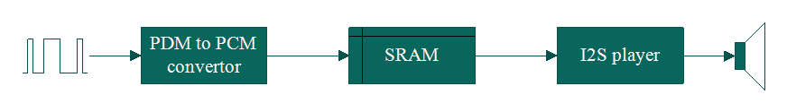

[Click here](../README.md) to view the README.

## Design and implementation

The design of this application is minimalistic to get started with code examples on PSOC&trade; Edge MCU devices. All PSOC&trade; Edge E84 MCU applications have a dual-CPU three-project structure to develop code for the CM33 and CM55 cores. The CM33 core has two separate projects for the secure processing environment (SPE) and non-secure processing environment (NSPE). A project folder consists of various subfolders, each denoting a specific aspect of the project. The three project folders are as follows:

**Table 1. Application projects**

Project | Description
--------|------------------------
*proj_cm33_s* | Project for CM33 secure processing environment (SPE)
*proj_cm33_ns* | Project for CM33 non-secure processing environment (NSPE)
*proj_cm55* | CM55 project

 

In this code example, at device reset, the secure boot process starts from the ROM boot with the secure enclave (SE) as the root of trust (RoT). From the secure enclave, the boot flow is passed on to the system CPU subsystem where the secure CM33 application starts. After all necessary secure configurations, the flow is passed on to the non-secure CM33 application. Resource initialization for this example is performed by this CM33 non-secure project. It configures the system clocks, pins, clock to peripheral connections, and other platform resources. It then enables the CM55 core using the `Cy_SysEnableCM55()` function and the CM55 core is subsequently put to DeepSleep mode.

In the CM33 non-secure application, the clocks and system resources are initialized by the BSP initialization function. The retarget-io middleware is configured to use the debug UART. The debug UART prints a message (as shown in [Terminal output on program startup](../images/terminal-pdm-to-i2s.png)) on the terminal emulator, the onboard KitProg3 acts the USB-UART bridge to create the virtual COM port. 

This code example shows how to record a short audio sample from a microphone and then play it on a speaker or headphone. The example uses the PDM/PCM block to interface with a digital microphone. All recorded data is stored in the internal SRAM. Once the recording completes, the I2S block starts sending data to an external audio codec TLV320DAC3100. Press the **User button 1** on the kit to record an audio sample. Once the button is released, it plays back the recorded audio when the button was pressed.

The `KIT_PSE84_EVAL` kit comes with a digital microphone and TLV320DAC3100 audio codec. The PDM/PCM hardware block of PSOC&trade; Edge MCU device converts this digital signal to a quantized 16-bit value (PCM). An interrupt is triggered when there is enough data to be processed (at least 32 samples). Transfer the audio data from the Rx buffer of PDM/PCM hardware block to an array allocated in the SRAM. Once the sound is recorded, the I2S driver transfers data from the SRAM to the Tx buffer.

In this application, the sampling rate is configured to 16 kHz/ksps. The word length of the PDM/PCM Rx buffer and the I2S Tx buffer are set to 16 bits.

I2S hardware block of PSOC&trade; Edge MCU can provide MCLK. The MCLK provided by the I2S hardware block is the interface clock of the I2S hardware block. To achieve the desired sampling frequency required by DAC of TLV320DAC3100 codec, multiple dividers are provided internal to the codec. For supported sampling rates, these dividers are automatically calculated when codec TLV320DAC3100 is initialized.

**Figure 1. Flow diagram for the PDM to I2S application**

The code example contains an I2C controller through which PSOC&trade; MCU configures the audio codec. The code example includes the TLV320DAC3100 library (directly added in source of *proj_cm33_ns*) to easily configure the TLV320DAC3100. 

**Figure 2. Flow diagram for the PDM to I2S audio data**

For more details on PDM/PCM and I2S interfaces, see the [PSOC&trade; Edge MCU reference manual](https://www.infineon.com/products/microcontroller/32-bit-psoc-arm-cortex/32-bit-psoc-edge-arm#documents).

 